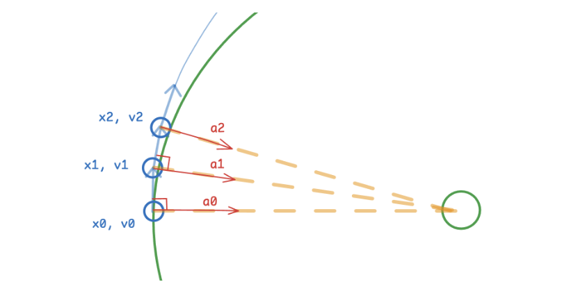

# Forward Euler
Written by Vadika Dubey

## Author's Notes:

I'm going to be oscillating between explaining mathematically and explaining the physics intuitively. I learned SO much writing this, not just about the theory itself, but about LATEX too-- it's a blessing to make cool, understandable equations... and a curse to type in. Enjoy!

## Numerical Integration: Euler's Family of Methods:

Numerical Integration refers to computational physics methods used to model any motions involving acceleration, i.e. to calculate what happens in the next \( dt \) time while controlling numerical errors. In this post, we're going to cover how Forward Euler and why we're rejecting it for this specific project.

### Explaining the Taylor Series

ALL HAIL 3B1B: https://www.youtube.com/watch?v=3d6DsjIBzJ4

THE BEST TAYLOR SERIES INTRODUCTION/EXPLANATION EVER

No seriously, watch it. It's the best intuitive explanation out there. I'm going to be assuming you've watched it because I'm not explaining what the video already explains, I'll be expanding on it instead.

So now after watching this video, we understand where the Taylor series comes from. Now, let's use it.

Say we want a position as a function of time, i.e. \( x(t) \), but we don't have it, we only have velocity, acceleration, jerk, etc. (basically we have all the derivatives' information). Then we've learned we can approximate the \( x(t) \) function as follows:

\( x(t) = x_{0} + \frac{ \left. \frac{d(x)}{dt} \right|_{t=0} \cdot t}{1!} + \frac{ \left. \frac{d^2(x)}{dt^2} \right|_{t=0} \cdot t^2}{2!} + \frac{ \left. \frac{d^3(x)}{dt^3} \right|_{t=0} \cdot t^3}{3!} + ... \)

Or \( x(t) = x_{0} + \frac{v_{0} \cdot t}{1!} + \frac{a_{0} \cdot t^2}{2!} + \frac{b_{0} \cdot t^3}{3!} + ...\)

This is called a global Taylor series, because we take our reference point as \( t=0 \), i.e. we find the \( x \) at some time \( t \) when we already know the information at \( t=0 \). AKA called Taylor expansion about \( 0 \).

There is also another way of looking at it, called the local Taylor series, aka Taylor expansion about \( t \). Say we use a global Taylor series approximation to get the \( x \) at time \( t = 5 \) seconds when we have information on \( t=0 \), and we want to find the x at time \( t=6 \) seconds now. You can either use the global Taylor series again to use the information on \( t=0 \) to give you the \( x \) at time \( t=6 \):

\( x(6) = x_{0} + \frac{v_{0} \cdot 6}{1!} + \frac{a_{0} \cdot 6^2}{2!} + \frac{b_{0} \cdot 6^3}{3!} + ...\) [substituting x=6 in same equation as given above]

Or you can use a local Taylor series to find the information at time \( t=6 \) seconds using the information we'd already found about \( x \) at time \( t=5 \) seconds:

\( x(6) = x_{5} + \frac{v_{5} \cdot (6-5)}{1!} + \frac{a_{5} \cdot (6-5)^2}{2!} + \frac{b_{5} \cdot (6-5)^3}{3!} + ...\) [this idea was explained in the 3b1b video]

More generally, we can rewrite this local Taylor series as:

\( x(t + \Delta t) = x_{t} + \frac{v_{t} \cdot \Delta t}{1!} + \frac{a_{t} \cdot (\Delta t)^2}{2!} + \frac{b_{t} \cdot (\Delta t)^3}{3!} + ...\)

I was curious, I tried to get this local Taylor series by subtracting the global Taylor series for \( x(t) \)  from the \( x(t + \Delta t) \) global series, but I realised that we end up getting extra terms for \( x(t + \Delta t) - x(t) \) because we're using terms like \( v_{0} \), \( a_{0} \) etc. instead of \( v_{t} \), \( a_{t} \), etc. It's much cleaner the local way, so we'll stick to that now.

### Forward Euler

Forward Euler is an explicit method of Numerical Integration that assumes that all terms from \( (\Delta t)^2 \) onward in the local Taylor series are small (since we're taking powers of an already small number) and therefore negligible. In other words, Forward Euler truncates Taylor expansion after first order term, and the cut terms are called "truncated error". Explicit here refers to the fact that the method predicts future occurrences based on current already-known variables.

It uses the equations:

\( x(t + \Delta t) = x_{t} + v_{t} \cdot \Delta t \)

\( v(t + \Delta t) = v_{t} + a_{t} \cdot \Delta t \) [anybody recognise this? it's \( v = u + at \) from high school!]

Since, in each of these equations, \( \Delta t \) has the greatest power of 1, we call this method a 1st order method. Naturally, I had the question: why stop at acceleration? What if acceleration is changing, do we add a third equation for jerk? (like \( a(t + \Delta t) = a_{t} + j_{t} \cdot \Delta t \))

Answer is, we don't need to! Coolest thing about acceleration is that it is connected to force via F = ma. So, if we can just find position and velocity of a body, that's all you really need to know in order to calculate the forces acting on it at that time. Just divide that by mass, and bam, you get the new acceleration at a new position without having to use jerk.

Getting back on track, I'll illustrate how exactly this method works with the classic example of an orbit, seeing its disadvantages and therefore why we're going to reject it.

First off, let's clear something up. The equation  \( v_{final} = v_{initial} + a \cdot \Delta t \), in general (for both large and small \(\Delta t \)'s) assumes acceleration to be constant over the interval \( \Delta t \), only then do all the terms after \(a \cdot \Delta t \) become zero. We could still use this for small \( \Delta t \)'s where acceleration is changing, simply because (1) mathematically, the terms afterward become negligible and (2) physically, we can easily write \( \Delta t \) as \( dt \) where \( dt \) is an infinitesimal change of time over which we can accurately consider \( a \) (or \( v \), by the same logic) to be constant (since it’s infinitesimally small, it doesn’t make much of a different saying “\( dt \)” or “at that instant of time”, see?).

However, we have a physical limit to how small we can make unit time changes on a computer. A computer cannot evaluate infinitely small time steps, since the computer itself doesn't run infinitely fast. We must choose a finite \( \Delta t \), and this is where the numerical error starts.

*[image created by yours truly]*

Take a look at the above, slightly exaggerated diagram. We have a smaller particle with position \( x_{0} \), velocity \( v_{0} \), and acceleration \( a_{0} \) in orbit around a larger particle. Normally the particle would take the green path on its orbit, if we were to continuously change the directions of acceleration and velocity perfectly. However, in the Forward Euler method, the computer assumes \(v_{0} \) and \( a_{0} \) to be constant over the next finite \( \Delta t \) time (this \( \Delta t \) time presumably being the smallest time-step we can practically simulate before computation becomes too expensive). In the first iteration, the computer calculates \( x_{1} = x_{0} + v_{0} \cdot \Delta t \) and moves the smaller ball along a straight line to \( x_{1} \) from \( x_{0} \). It then calculates \( v_{1} = v_{0} + a_{0} \cdot \Delta t \) (since these are vectors, you'd actually have to run this method independently for each of the three dimensions) to update it to \( v_{1} \). See how the blue path of Forward Euler very slightly deviates from the green path it was to originally take? In reality, it would be even smaller. And a great number of small lines connected together successively creates a near-curve, so it's a somewhat valid (although basic) way of simulating continuously changing acceleration. It usually works for models that don't require a lot of precision.

**Tiny Note:** you could actually reverse it and calculate \( v_{1} \) first and then use that for calculating \( x_{1} \), this method is actually called Semi-Implicit Euler and apparently makes the simulation much more stable. But we won't be diving into that, since numerical integration has many methods and looking at all of them would take forever, and we've got a project to make.

However, clearly, for long term gravitational physics models, we cannot use Forward Euler. In this diagram, we can see how the actual trajectory of the smaller ball is overshooting the original orbit, therefore giving the wrong trajectory and systematically making our simulation gain energy (as a bounded orbiting object moves away from the object at centre of orbit, it gains energy). That's the main disadvantage Forward Euler is known for having: not being able to conserve energy. For our star model, this is detrimental. 

And so we'll move on, to learn about more numerical integration methods!